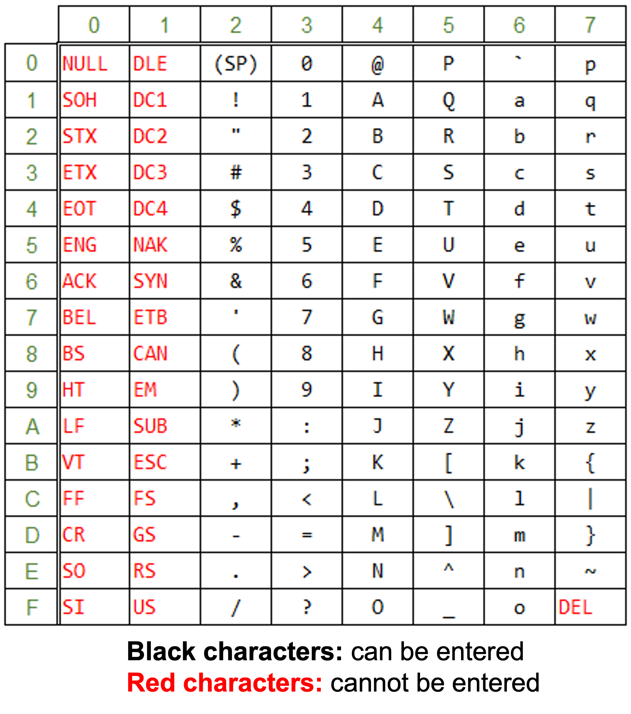
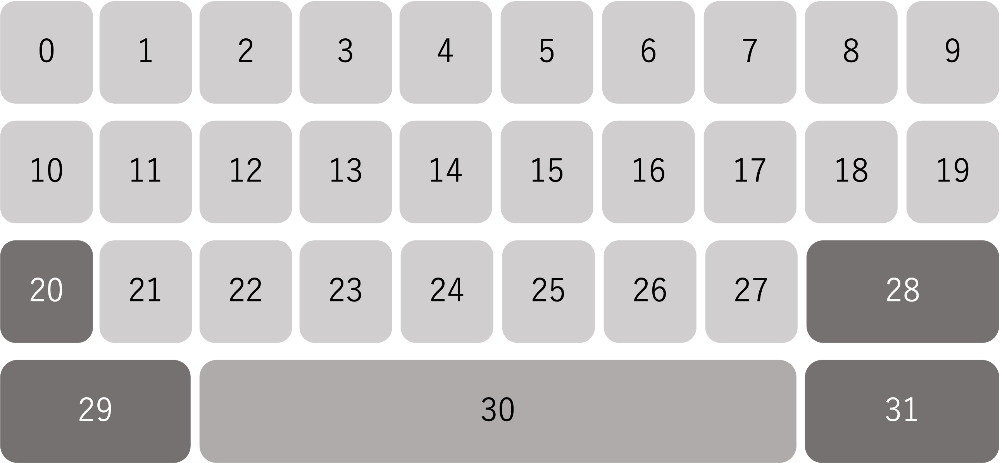
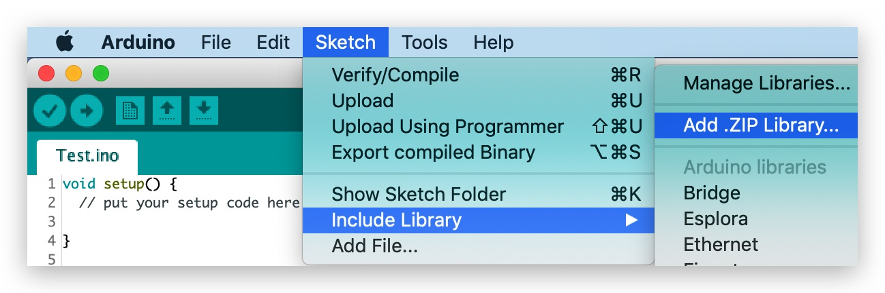
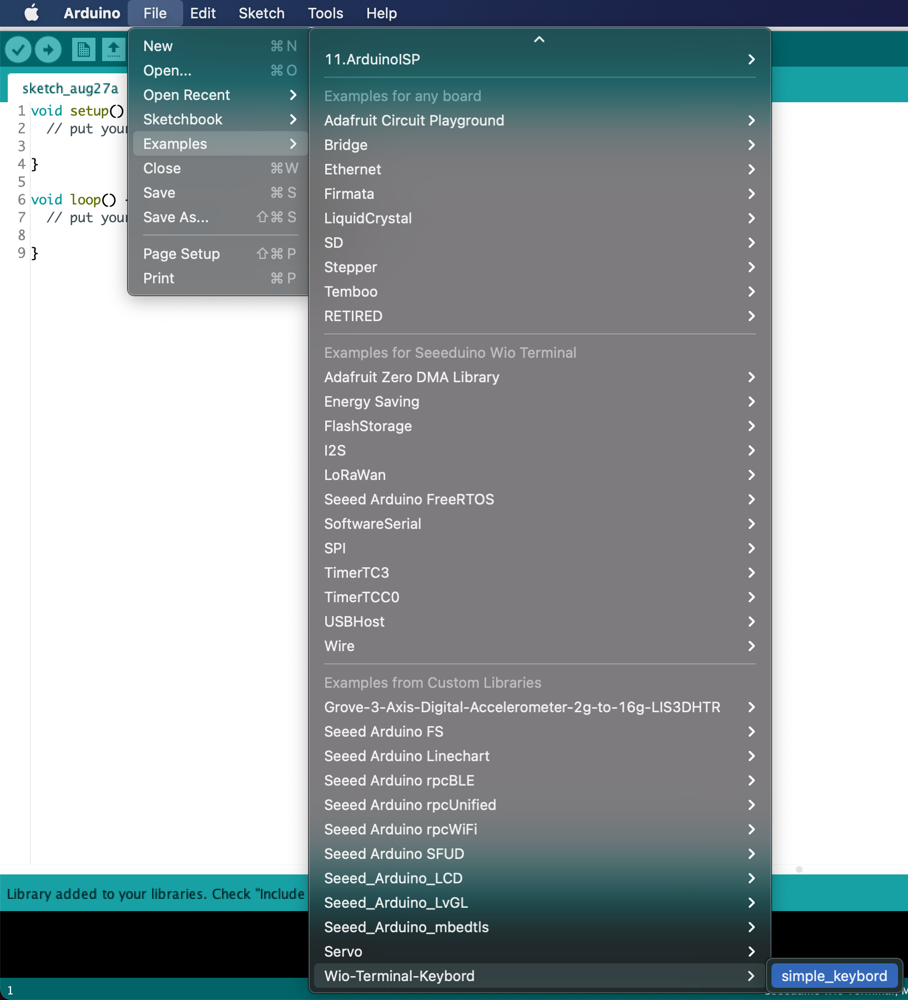
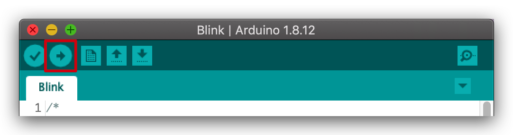

# Wio-Terminal-Keybord
[Wio-Terminal-Keybord](https://github.com/Field-Black/Wio-Terminal-Keybord) is a library written in C++ that creates a screen keyboard on Wio Terminal.
If you download this repository, you can install it as `Free_Keybord.h` in the Arduino IDE.
 
# DEMO
 

 
# Features
 
 - ASCII 32~126 is available.  
 
 - The keyboard can be displayed anywhere on the LCD screen. 
 - The character layout of the keyboard can be changed.  
It is possible to set the character corresponding to the key number below.
 

 - The size and color of the keyboard can be changed.
 - It can also be used on LCDs other than Wio Terminal that support [TFT LCD](https://github.com/Seeed-Studio/Seeed_Arduino_LCD) library, although this has not been tested.

 
# Requirement
 
If you have read through the [Wio Terminal WiKi](https://wiki.seeedstudio.com/Wio-Terminal-Getting-Started/), there are no specific libraries you need. The following is a list of required libraries.
 
 - Boards Manager
   - Seed SAMD Boards 1.8.2
 - Libraries
   - [Seeed_Arduino_LCD](https://wiki.seeedstudio.com/Wio-Terminal-Getting-Started/)
 
# Installation
 
1. Visit the [Wio-Terminal-Keybord](https://github.com/Field-Black/Wio-Terminal-Keybord) repositories and download the entire repo to your local drive.
2. Now, the `Free_Keybord.h` library can be installed to the Arduino IDE. Open the Arduino IDE, and click `sketch` -> `Include Library` -> `Add .ZIP Library`, and choose the `Wio-Terminal-Keybord` file that you've have just downloaded.
 
 
# Usage
 
1. Open Arduino IDE.
2. Open the simple keybord example sketch: `File` -> `Examples` -> `Wio-Terminal-Keybord` -> `Blink`.

3. Now, simply click the Upload button in the environment. Wait a few seconds and if the upload is successful, the message "Done uploading." will appear in the status bar.
   
   
   A few seconds after the upload finishes, you should see the screen keyboard at LCD of the Wio Terminal. You can use the 5-Way Switch to enter text. If you have problems, please see the [FAQ](https://wiki.seeedstudio.com/Wio-Terminal-Getting-Started/) suggestions.
   
   If you are not able to upload the sketch, mostly it's because Arduino IDE was not able to put Wio Terminal to bootloader mode. (Because MCU was halted or your program handling USB,) Workaround is putting your Wio Terminal to bootloader mode manually, as shown in [FAQ](https://wiki.seeedstudio.com/Wio-Terminal-Getting-Started/).
 

